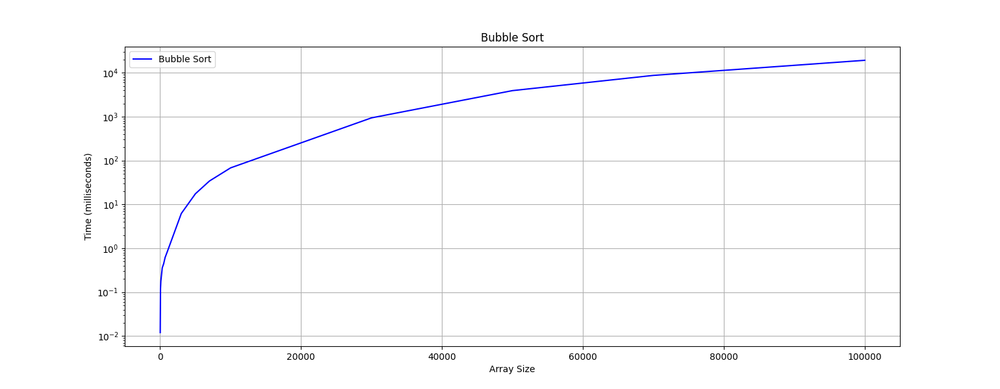
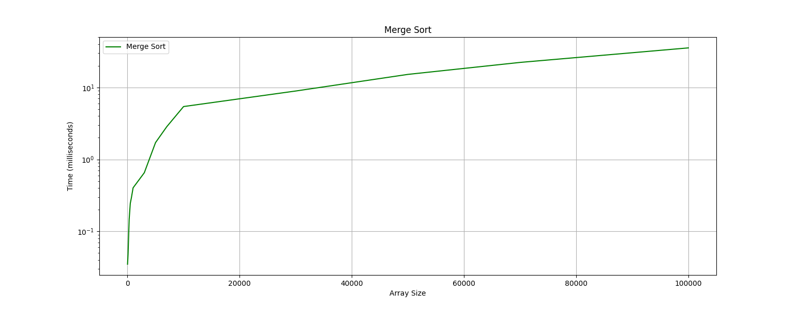
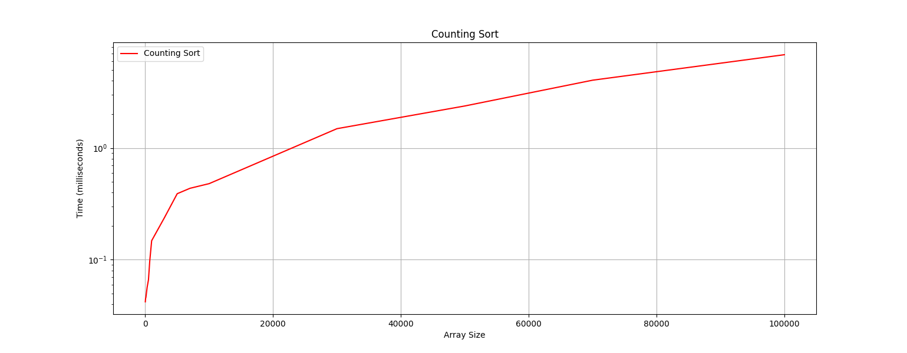
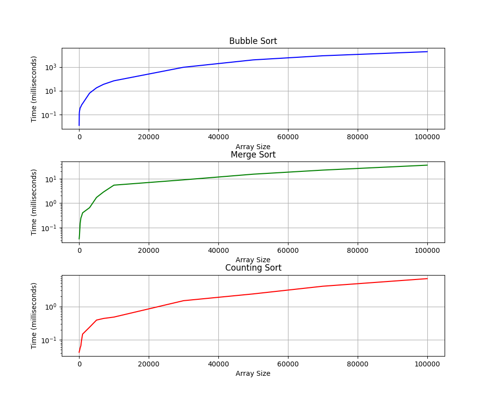
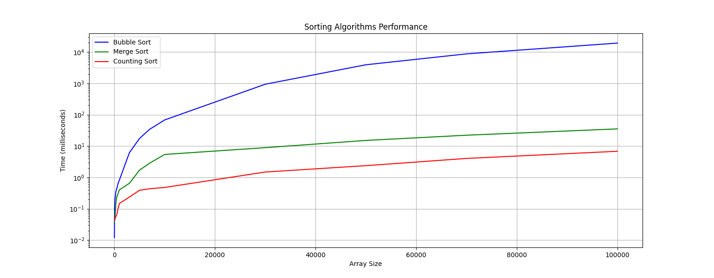

# Sorting Techniques

Implementation of various sorting techniques in Java. The primary objective is
to comprehend the functionality and performance characteristics of these
algorithms. Through practical implementation and comparison, this exploration
aims to facilitate informed decision-making regarding the selection of sorting
algorithms for diverse applications.

## **Sorting Techniques**

Three fundamental sorting techniques are implemented:

1. **Bubble Sort**: A simple and intuitive sorting algorithm with a time complexity of O(n^2). It iteratively compares adjacent elements and swaps them if they are in the wrong order.
    
    ```cpp
    bubbleSort(array)
        n = length(array)
        for i from 0 to n-1
            for j from 0 to n-i-1
                if array[j] > array[j+1]
                    swap(array[j], array[j+1])
    return array
    ```
    
2. **Merge Sort**: A divide-and-conquer algorithm known for its efficiency with a time complexity of O(n log n). It recursively divides the array into halves, sorts them individually, and then merges them.
    
    ```cpp
    mergeSort(array)
        if length(array) <= 1
            return array
        middle = length(array) / 2
        left = mergeSort(first half of array)
        right = mergeSort(second half of array)
        return merge(left, right)
    
    merge(left, right)
        result = new empty list
        leftIndex = 0
        rightIndex = 0
        while leftIndex < length(left) and rightIndex < length(right)
            if left[leftIndex] <= right[rightIndex]
                append left[leftIndex] to result
                leftIndex = leftIndex + 1
            else
                append right[rightIndex] to result
                rightIndex = rightIndex + 1
        while leftIndex < length(left)
            append left[leftIndex] to result
            leftIndex = leftIndex + 1
        while rightIndex < length(right)
            append right[rightIndex] to result
            rightIndex = rightIndex + 1
        return result
    ```
    
3. **Counting Sort**: A linear-time sorting algorithm with a time complexity of O(n). It works by counting the number of occurrences of each unique element in the input array and using arithmetic to determine its position in the sorted output.
    
    ```cpp
    countingSort(array)
        max = maximum value in array
        min = minimum value in array
        range = max - min + 1
        count[] = new array of size range
        output[] = new array of the same size
        for i from 0 to length(array)-1
            count[A[i] - min] = count[A[i] - min] + 1
        for i in array
            while count[i - min] > 0
    		        count[i - min] -= 1
                output[count[i - min]] = i
        return output
    ```
    

## **Comparison between Sorting Algorithms**

| Sorting Algorithm | Time Complexity (Big O) | Time Complexity (Theta) | Time Complexity (Omega) | Space Complexity |
| --- | --- | --- | --- | --- |
| Bubble Sort | $O(n^2)$ | $Θ(n^2)$ | $Ω(n)$ | $O(1)$ |
| Merge Sort | $O(n \log{n})$ | $Θ(n\log{n})$ | $Ω(n\log{n})$ | $O(n)$ |
| Counting Sort         $(k = max - min )$ | $O(n + k)$ | $Θ(n + k)$ | $Ω(n + k)$ | $O(n + k)$ |


## Command Line Interface

A command-line interface is provided to interact with the implemented sorting algorithms. The interface takes the path of the file containing the list of elements as input and allows users to choose one of the three sorting algorithms to run.

## Java Unit Testing

A suite of JUnit tests is included to ensure the correctness and efficiency of the implemented sorting algorithms. These tests cover various scenarios, including worst-case, best-case, and average-case scenarios, providing comprehensive validation of the algorithms' functionality.

## **Mean time calculation**

The **`MeanTime`** class facilitates the evaluation of sorting algorithms by generating random arrays of varying sizes and calculating the mean time required to sort them. It offers the following key functionalities:

1. **generateRandomArray(int size)**:
    - Generates a random array of integers with the specified size.
2. **calculateMeanSortingTime(String sortingAlgorithm, int[] sizes, int iterations)**:
    - Computes the mean time taken to sort arrays of different sizes using a specified sorting algorithm.

## **Mean Sorting Times Analysis**

After obtaining the mean sorting times for various array sizes across different sorting algorithms, we utilized a Python script to visualize the output. Below are the visual representations and the table summarizing the data:

### Bubble Sort Graph:



### Merge Sort Graph:



### Counting Sort Graph:



### Combined Graph for all Sorting Techniques:





### **Mean Sorting Times Table:**

| Array Size | Bubble Sort | Merge Sort | Counting Sort |
| --- | --- | --- | --- |
| 10 | 0.012 | 0.035 | 0.042 |
| 50 | 0.120 | 0.040 | 0.045 |
| 100 | 0.179 | 0.048 | 0.046 |
| 300 | 0.360 | 0.147 | 0.057 |
| 500 | 0.446 | 0.245 | 0.066 |
| 700 | 0.616 | 0.294 | 0.097 |
| 1000 | 0.827 | 0.403 | 0.148 |
| 3000 | 6.213 | 0.653 | 0.238 |
| 5000 | 17.493 | 1.712 | 0.390 |
| 7000 | 34.234 | 2.845 | 0.436 |
| 10000 | 68.227 | 5.423 | 0.480 |
| 30000 | 940.947 | 8.919 | 1.490 |
| 50000 | 3926.765 | 15.176 | 2.379 |
| 70000 | 8735.011 | 22.260 | 4.047 |
| 100000 | 19288.662 | 35.421 | 6.843 |

